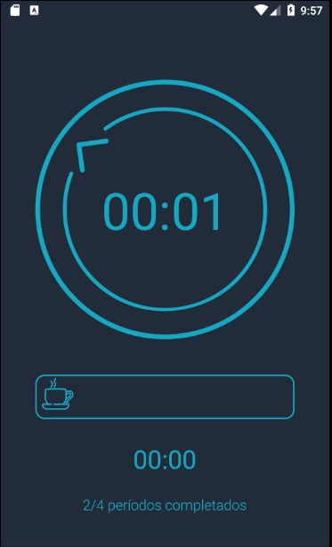

# Pomodoro Timer

Aplicación de práctica enfocada en el    uso de la técnica Pomodoro. Esta ténica se enfoca en la gestión del tiempo
para obtener la mayor productividad posible. En este método se divide el tiempo en periodos de 25 minutos con
descansos intermedios de 5 minutos.

## Screenshots
Splash | Inicio | Pomodoro | Fin
------ | -----  | ------   | --------
 |  |  | 

Información 1 | Información 2 | Información 3
------        | -----         | ------
 |  | 